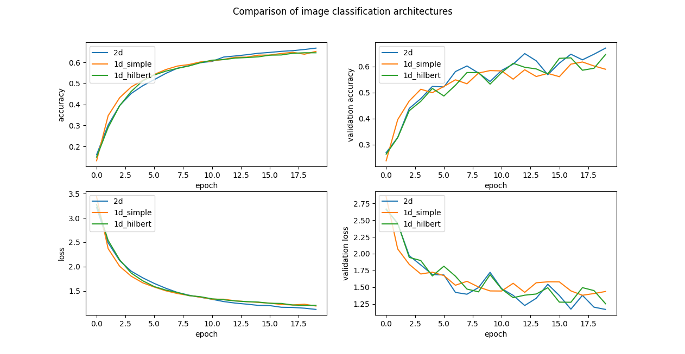

# Image Classification with 1D Convolutions after Hilbert Curve based Flattening

This repository contains the code for a simple experiment to see what influence the flattening method in a flatten layer 
has on image classification, when using 1D convolutions over the flattened image. 

## Hilbert Curve Flatten (HCFlatten)

Given an image of size `(n, n, 3)` where `n = 2^k` for some `k in N, k > 1` the HCFlatten layer defines a mapping
`H_n: N**2 -> N` such that:

```

                               A---B   C---D
                                   |   |    
                               E---F   G---H
                HCFlatten      |           |   --->   A-B-F-E-I-M-N-J-K-O-P-L-H-G-C-D
                               I   J---K   L
                               |   |   |   | 
                               M---N   O---P
    
    
    
                               A---B---C---D
                               ┌-----------┘
                               E---F---G---H
                 Flatten       ┌-----------┘   --->   A-B-C-D-E-F-G-H-I-J-K-L-M-N-O-P
                               I---J---K---L
                               ┌-----------┘
                               M---N---O---P

```

## Experimental setup

Three different models are defined in `benchmarks.py`. The models are trained on the NWPU-RESISC45 dataset 
[[1]](#References). Due to memory limitations the training data was limited to the first 60%, validation data to the 
last 5%. Image augmentation is performed on the training data. The following three models are compared.

* 2d ConvNet (1,677,133 Parameters)
* 1D ConvNet with simple flatten (1,689,413 Parameters)
* 1D ConvNet with HCFlatten (1,689,413 Parameters)

Images are all 512x512 pixels with three color channels.

## Results

The 2D ConvNet unsurprisingly outperforms both 1D variants. 

The hilbert curve based flattening layer only marginally outperformed the simple flattening approach.

| Architecture | Val Loss   | Val Accuracy |
|--------------|------------|--------------|
| *2D Convnet* | *1.1674*   | *0.6711*     |
| 1D Simple    | 1.3788     | 0.6178       |
| 1D HCFlatten | **1.2528** | **0.6463**   |




## References
[1] G. Cheng, J. Han, X. Lu. Remote Sensing Image Scene Classification: Benchmark and State of the Art. Proceedings of the IEEE.
